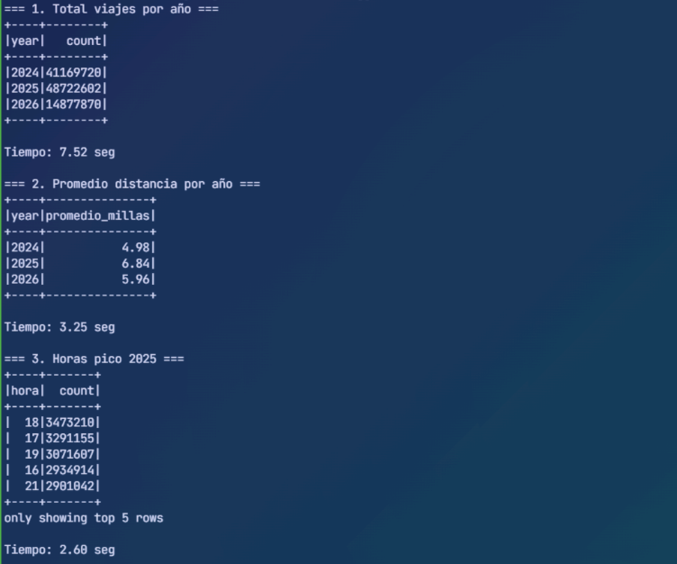
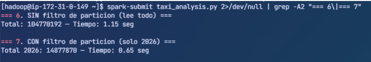
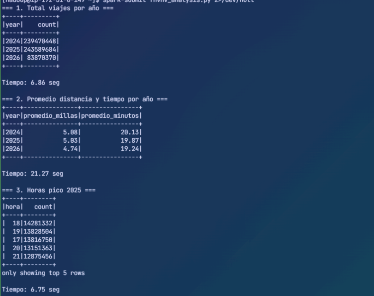
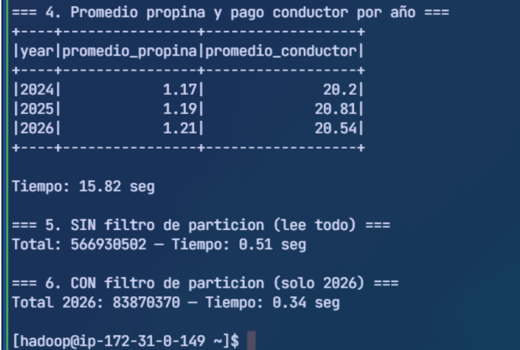

# Análisis Distribuido con PySpark en Amazon EMR

**Curso:** BigData 2026
**Alumno:** Rivas Huanca, Diego Raúl

> Configuración SSH y Wave: ver [dev-environment-setup](https://github.com/DiegoRivas1/dev-environment-setup.git)
> Laboratorio anterior (Hive): ver [bd-hive-emr](https://github.com/DiegoRivas1/bd-hive-emr.git)

---

## Arquitectura del clúster

- Amazon EMR 7.13.0, Spark 3.5.6, Hadoop 3.4.2, Hive 3.1.3
- 1 nodo master m5.xlarge (4 vCPU, 16 GB RAM)
- 3 nodos worker Core m5.xlarge (4 vCPU, 16 GB RAM c/u)
- Almacenamiento: Amazon S3

---

## Datasets utilizados

| Dataset | Tamaño | Registros | Descripción |
|---------|--------|-----------|-------------|
| Project Gutenberg | ~1.5 MB | 3 archivos | Pride and Prejudice, Alice in Wonderland, Sherlock Holmes |
| Simple Wikipedia | ~1.7 GB | 4 archivos combinados | 293,808 artículos extraídos del dump oficial |
| NYC Yellow Taxi | ~1.7 GB | 104,770,192 viajes | 28 meses 2024-2026, particionado year/month |
| NYC FHVHV (Uber/Lyft) | ~13 GB | 566,930,502 viajes | 28 meses 2024-2026, particionado year/month |

### Preparacion del dataset de Gutenberg Prueba

```bash
mkdir input
wget -O input/doc1.txt https://www.gutenberg.org/cache/epub/1342/pg1342.txt
wget -O input/doc2.txt https://www.gutenberg.org/cache/epub/11/pg11.txt
wget -O input/doc3.txt https://www.gutenberg.org/cache/epub/1661/pg1661.txt

aws s3 cp input/ s3://lab03-indice-invertido/input/ --recursive
```

### Preparación del dataset Wikipedia

```bash
# Descargar dump Simple Wikipedia
cd /mnt
wget -q https://dumps.wikimedia.org/simplewiki/latest/simplewiki-latest-pages-articles.xml.bz2
bzip2 -d simplewiki-latest-pages-articles.xml.bz2
# Resultado: 1.6 GB XML, 30 millones de lineas

# Convertir XML a archivos txt (293,808 articulos)
cd ~
aws s3 cp s3://lab03-indice-invertido/scripts/parse_wiki.py .
sed -i 's/max_docs = 5000/max_docs = 999999/' parse_wiki.py
python3 parse_wiki.py

# Combinar en 1 archivo de 428 MB
mkdir -p /mnt/wiki_combined_large
find /mnt/wiki_docs -name "*.txt" -print0 | \
  xargs -0 cat > /mnt/wiki_combined_large/wiki_part_1.txt

# Duplicar para llegar a ~1.7 GB
cp /mnt/wiki_combined_large/wiki_part_1.txt /mnt/wiki_combined_large/wiki_part_2.txt
cp /mnt/wiki_combined_large/wiki_part_1.txt /mnt/wiki_combined_large/wiki_part_3.txt
cp /mnt/wiki_combined_large/wiki_part_1.txt /mnt/wiki_combined_large/wiki_part_4.txt

# Subir a S3
aws s3 cp /mnt/wiki_combined_large/ \
  s3://lab03-indice-invertido/wiki_combined_large/ --recursive
```

> Nota: se usan 4 archivos grandes en vez de 293,808 archivos individuales para evitar
> el overhead de listar millones de objetos en S3.

---

## Estructura S3

```
s3://lab03-indice-invertido/
├── input/                      3 libros Gutenberg
├── wiki_combined_large/        4 archivos Wikipedia ~1.7 GB
├── taxi_partitioned/           Yellow Taxi 28 meses (year=/month=)
├── fhvhv_partitioned/          FHVHV 28 meses (year=/month=)
└── spark_scripts/              Scripts PySpark
```

---

## Cómo ejecutar los scripts

```bash
# Recuperar scripts de S3
aws s3 cp s3://lab03-indice-invertido/spark_scripts/ ~/ --recursive

# Ejecutar
#Archivos pequeños
spark-submit wordcount.py
spark-submit inverted_index.py

#Archivos grandes
#wordcount de spark
spark-submit --driver-memory 4g --executor-memory 6g wiki_combined_large.py
#indice invertido de spark
time spark-submit --driver-memory 4g --executor-memory 6g inverted_spark.py
#Anlisis
spark-submit taxi_analysis.py
spark-submit fhvhv_analysis.py
```

Ver [dev-environment-setup](https://github.com/DiegoRivas1/dev-environment-setup.git) para configurar SSH y Wave.

---

## Ejercicio 1 WordCount

### Gutenberg (~1.5 MB)

Ejecutamos el script de WordCount:
```python
spark-submit wordcount.py
```

**Tiempo: 14 seg**

### Wikipedia (~1.7 GB) comparativa 3 tecnologías

**Spark:**
```bash
#wordcount de spark
time spark-submit --driver-memory 4g --executor-memory 6g wiki_combined_large.py
```

**Hive:**

Ingresamos a Hive CLI desde el master:
```python
hive
```
Y creamos la tabla externa apuntando a los archivos de Wikipedia y ejecutamos la consulta:
```sql
CREATE EXTERNAL TABLE wiki_text (line STRING)
STORED AS TEXTFILE
LOCATION 's3://lab03-indice-invertido/wiki_combined_large/';

SELECT word, COUNT(*) AS freq
FROM (
    SELECT explode(split(lower(line), '[^a-z]+')) AS word
    FROM wiki_text
) t
WHERE length(word) > 2
GROUP BY word
ORDER BY freq DESC
LIMIT 20;
```

**MapReduce:**

Borramos la salida anterior si existe:
```bash
hdfs dfs -rm -r /user/hadoop/wc_output
```

Ejecutamos en el master el streaming de Hadoop con los scripts mapper.py y reducer.py:
```bash
time hadoop jar /usr/lib/hadoop-mapreduce/hadoop-streaming.jar \
  -files mapper.py,reducer.py \
  -mapper mapper.py \
  -reducer reducer.py \
  -input s3://lab03-indice-invertido/wiki_combined_large/ \
  -output /user/hadoop/wc_output
```

**Resultados WordCount Wikipedia:**
```
+----------+--------+
|word      |count   |
+----------+--------+
|the       |11504088|
|and       | 4450484|
|category  | 3565704|
|was       | 2087480|
|for       | 1622936|
+----------+--------+
```

| Tecnología | Tiempo |
|-----------|--------|
| Spark | 56.11 seg |
| Hive | 130.23 seg |
| MapReduce | 664.54 seg (11 min) |

---

## Ejercicio 2 Índice Invertido

### Gutenberg (~1.5 MB)

Ejecutamos el script de índice invertido:
```python
spark-submit inverted_index.py
```

**Tiempo: 12 seg**

### Wikipedia (~1.7 GB) comparativa 3 tecnologías

**Spark:**
Ejecutamos:
```python
time spark-submit --driver-memory 4g --executor-memory 6g inverted_spark.py
```

**Hive:**

Ingresamos a Hive CLI desde el master:
```python
hive
```

Ejecutamos la consulta para obtener el índice invertido:

```sql
SELECT word, collect_set(INPUT__FILE__NAME) AS docs
FROM wiki_text
LATERAL VIEW explode(split(lower(line), '[^a-z]+')) e AS word
WHERE length(word) > 2
GROUP BY word
LIMIT 20;
```

**MapReduce:**
Borramos la salida anterior si existe:
```bash
hdfs dfs -rm -r /user/hadoop/inverted_output
```

Ejecutamos el job:
```bash
time hadoop jar /usr/lib/hadoop-mapreduce/hadoop-streaming.jar \
  -files mapper_inverted.py,reducer_inverted.py \
  -mapper mapper_inverted.py \
  -reducer reducer_inverted.py \
  -input s3://lab03-indice-invertido/wiki_combined_large/ \
  -output /user/hadoop/inverted_output

hdfs dfs -cat /user/hadoop/inverted_output/part-* | head -20
```

| Tecnología | Tiempo |
|-----------|--------|
| Hive | 206.56 seg |
| Spark | 219.34 seg |
| MapReduce | 712.58 seg (11 min 52 seg) |

> Hive superó ligeramente a Spark en índice invertido porque Tez ejecutó
> el collect_set de forma muy eficiente con solo 4 archivos grandes.

---

## Ejercicio 3 Análisis Comparativo Final

### WordCount e Índice Invertido

| Operación | Dataset | Spark | Hive | MapReduce |
|-----------|---------|-------|------|-----------|
| WordCount | 1.5 MB Gutenberg | 14 seg | 13 seg | ~18 seg |
| WordCount | 1.7 GB Wikipedia | 56 seg | 130 seg | 665 seg |
| Índice invertido | 1.5 MB Gutenberg | 12 seg | 1.8 seg | ~18 seg |
| Índice invertido | 1.7 GB Wikipedia | 219 seg | 206 seg | 713 seg |

### NYC Taxi

| Operación | Dataset | Spark | Hive | MapReduce |
|-----------|---------|-------|------|-----------|
| 5 consultas analíticas | 1.7 GB / 104M viajes | ~34 seg total | ~100 seg c/u | no aplica* |
| 4 consultas analíticas | 13 GB / 566M viajes | ~2 min total | ~150 seg c/u | no aplica* |
| SIN partición COUNT | 1.7 GB Yellow Taxi | 1.15 seg | 15.57 seg | no aplica* |
| CON partición COUNT | 250 MB (2026) | 0.65 seg | 5.28 seg | no aplica* |
| SIN partición COUNT | 13 GB FHVHV | 0.51 seg | 114 seg | no aplica* |
| CON partición COUNT | 1.9 GB (2026) | 0.34 seg | 30 seg | no aplica* |

*MapReduce no aplica para análisis SQL requeriría un mapper/reducer custom por cada consulta.

### Conclusiones

**Spark es el más rápido en datos grandes:** 11.8x más rápido que MapReduce en WordCount.
Usa procesamiento en memoria con Catalyst Optimizer y Tungsten Engine.

**Hive es competitivo con datos medianos:** superó a Spark en índice invertido con 4 archivos
grandes gracias a Tez. Es la mejor opción cuando el equipo conoce SQL y los datos son estructurados.

**MapReduce es el más lento:** escribe resultados intermedios a disco entre Map y Reduce.
Sigue siendo útil para lógica muy personalizada que SQL no puede expresar.

**El particionamiento beneficia más a Hive que a Spark:** Spark ya es tan rápido leyendo
parquet que el partition pruning reduce el tiempo de 1.15 seg a 0.65 seg (1.8x).
En Hive la mejora es de 15.57 seg a 5.28 seg (3x).

---

## Ejercicio 4 NYC Taxi con Spark

### Yellow Taxi particionado (28 meses, 104M viajes)

Ejecutamos el script de análisis:
```python
spark-submit taxi_analysis.py
```

Ejecucion especifica:
```python
spark-submit taxi_analysis.py 2>/dev/null | grep -A2 "=== 6\|=== 7"
```

**Resultados Yellow Taxi:**
```
=== 1. Total viajes por año ===
+----+--------+
|year|   count|
+----+--------+
|2024|41169720|
|2025|48722602|
|2026|14877870|
+----+--------+

=== 2. Promedio distancia por año ===
+----+----------------+
|year| promedio_millas|
+----+----------------+
|2024| 4.98           |
|2025| 6.84           |
|2026| 5.96           |

........................
```

### FHVHV Uber/Lyft particionado (28 meses, 566M viajes)

Ejecutamos el job:
```python
spark-submit fhvhv_analysis.py
```
 o
```
spark-submit fhvhv_analysis.py 2>/dev/null 
```

**Resultados FHVHV:**
```
=== 1. Total viajes por año ===
+----+---------+
|year|    count|
+----+---------+
|2024|239470448|
|2025|243589684|
|2026| 83870370|
TOTAL: 566,930,502
+----+---------+

=== 2. Promedio distancia y tiempo por año ===
+----+----------------+-----------------+
|year| promedio_millas| promedio_minutos|
+----+----------------+-----------------+
|2024| 5.08           | 20.13           |
|2025| 5.03           | 19.87           |
|2026| 4.74           | 19.24           |

..................................
```

---

## Capturas

### Yellow Taxi consultas analíticas


### Yellow Taxi particionamiento


### FHVHV consultas analíticas


### FHVHV particionamiento

